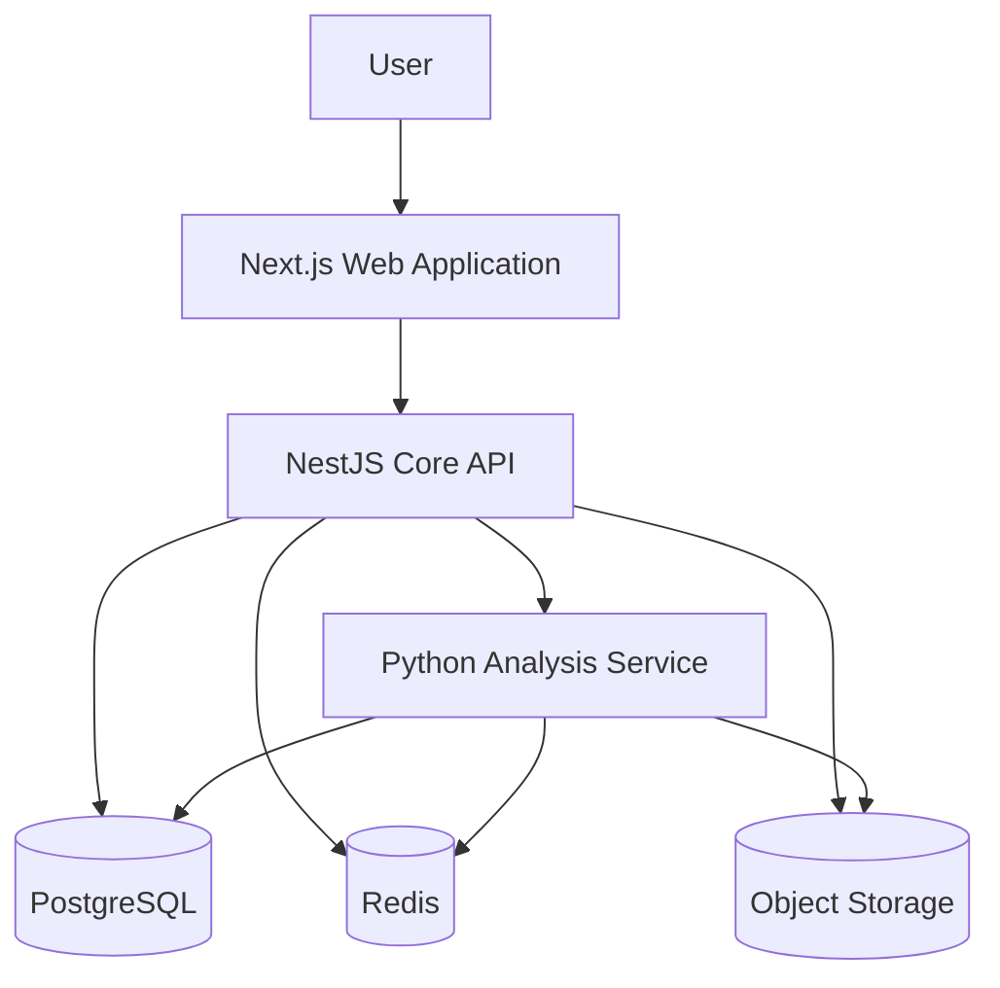

# ForecastMe System Architecture

## 1. Introduction

ForecastMe is a modular predictive intelligence platform designed to help users analyze uncertain outcomes and make evidence-based decisions.

The platform will eventually support multiple prediction domains, including:

- Sports
- Betting markets
- Stocks
- Cryptocurrency
- Economics
- Weather
- Risk analysis
- User-provided datasets
- Custom probability questions

ForecastMe is not being designed as a single-purpose betting application. It is being designed as a general forecasting platform where domain-specific data sources, prediction models, and analytical workflows can be added incrementally.

The initial architecture focuses on clear service boundaries, maintainability, independent scaling, and controlled complexity.

The system will begin with six primary components:

1. Web application
2. Core API
3. Analysis service
4. PostgreSQL
5. Redis
6. Object storage

Technologies such as Kafka and Kubernetes are intentionally excluded from the initial implementation. They will only be introduced when the system has operational requirements that justify their complexity.

---

## 2. Architecture Goals

The initial ForecastMe architecture must support the following goals:

### 2.1 Separation of concerns

Each service must have a clearly defined responsibility.

The frontend must not contain prediction logic.

The Core API must not become responsible for training machine-learning models.

The Analysis Service must not directly manage user authentication or browser sessions.

### 2.2 Independent development

The TypeScript application layer and Python analysis layer must be capable of evolving independently while communicating through stable contracts.

### 2.3 Extensibility

New prediction domains must be introduced without requiring the entire application to be redesigned.

For example, the platform should eventually be able to add:

- Football match predictions
- Boxing outcome predictions
- Stock-price forecasting
- Portfolio risk analysis
- Weather forecasting
- Economic indicator forecasting

### 2.4 Traceability

Every analysis should eventually be traceable through:

- User input
- Data sources
- Model version
- Processing steps
- Generated probabilities
- Confidence or uncertainty values
- Final recommendation
- Timestamp

### 2.5 Responsible forecasting

ForecastMe must distinguish between:

- Observed facts
- Model estimates
- Assumptions
- Uncertainty
- Recommendations

The system must avoid presenting predictions as guaranteed outcomes.

---

## 3. High-Level Architecture



The primary request path is:

```text
Next.js frontend
        ↓
NestJS Core API
        ↓
Python Analysis Service
        ↓
PostgreSQL / Redis / Object Storage
```

The NestJS Core API acts as the controlled entry point for application operations.

The browser should not call the Python Analysis Service directly in the production architecture.

---

## 4. System Components

## 4.1 Web Application

### Technology

- Next.js
- React
- TypeScript
- Tailwind CSS
- shadcn/ui
- TanStack Query
- Zustand
- Recharts or Apache ECharts

### Location

```text
apps/web
```

### Responsibilities

The Web Application is responsible for:

- Rendering the user interface
- Accepting user questions
- Accepting dataset uploads
- Displaying analysis results
- Displaying probability estimates
- Displaying charts and visualizations
- Managing client-side interface state
- Managing authenticated user sessions
- Calling the Core API
- Displaying analysis history
- Displaying loading, validation, and error states

### Restrictions

The Web Application must not:

- Connect directly to PostgreSQL
- Connect directly to Redis
- Store object-storage credentials
- Perform authoritative probability calculations
- Train machine-learning models
- Call the Analysis Service directly in production
- Contain private provider API keys

---

## 4.2 Core API

### Technology

- NestJS
- TypeScript
- REST
- OpenAPI
- GraphQL where justified
- gRPC for selected internal communication where justified

### Location

```text
apps/api
```

### Responsibilities

The Core API is the central application and orchestration layer.

It is responsible for:

- Authentication
- Authorization
- User management
- Request validation
- Analysis request creation
- Analysis orchestration
- Analysis history
- File-upload coordination
- Data-source management
- Usage controls
- Rate limiting
- Audit logging
- Calling the Analysis Service
- Persisting application records
- Returning normalized responses to the Web Application

### Why NestJS is the gateway

The NestJS application provides a single controlled entry point for the frontend.

This prevents the browser from needing to understand:

- Internal service locations
- Python-service contracts
- Database credentials
- Storage credentials
- Model-provider credentials
- Internal authentication mechanisms

The Core API protects internal services and converts user-facing requests into validated internal operations.

### Restrictions

The Core API must not become the primary location for:

- pandas-based data processing
- Statistical modeling
- Feature engineering
- Machine-learning training
- Machine-learning inference pipelines
- Large numerical computations

Those responsibilities belong to the Analysis Service.

---

## 4.3 Analysis Service

### Technology

- Python
- FastAPI
- Pydantic
- pandas
- Polars
- NumPy
- SciPy
- scikit-learn
- XGBoost
- LightGBM

### Location

```text
services/prediction-service
```

The existing directory is named `prediction-service`. Architecturally, it represents the ForecastMe Analysis Service.

A future rename can be considered, but it is not required during Day 2.

### Responsibilities

The Analysis Service is responsible for:

- Statistical analysis
- Probability calculations
- Dataset profiling
- Data cleaning
- Feature engineering
- Model inference
- Model training workflows
- Model evaluation
- Confidence estimation
- Forecast generation
- Domain-specific prediction logic
- Returning structured analytical results

### Example analytical tasks

The service may eventually process requests such as:

```text
What is the estimated probability that Team A defeats Team B?
```

```text
What is the expected return and risk of this stock position?
```

```text
Analyze this uploaded dataset and identify the strongest predictors.
```

```text
Estimate the probability that inflation exceeds a given threshold.
```

### Restrictions

The Analysis Service must not be directly responsible for:

- Browser authentication
- User-session management
- Frontend presentation
- Subscription billing
- User-interface state
- General application authorization
- Public file-upload endpoints without API mediation

---

## 4.4 PostgreSQL

### Purpose

PostgreSQL is the system of record for durable relational data.

### Responsibilities

PostgreSQL will eventually store:

- Users
- Accounts
- Roles
- Sessions
- Analysis requests
- Analysis results
- Forecast records
- Data-source metadata
- Uploaded-file metadata
- Model metadata
- Model versions
- Audit events
- User preferences
- Portfolio records
- Domain configurations

### Example future entities

```text
User
Analysis
AnalysisResult
Forecast
DataSource
UploadedFile
Model
ModelVersion
AuditEvent
```

### Data ownership

The Core API is the primary owner of application-level database operations.

The Analysis Service may access analytical records where necessary, but access should be controlled and minimized.

Where practical, the Analysis Service should receive required data through an internal API contract instead of tightly coupling itself to the full application database schema.

---

## 4.5 Redis

### Purpose

Redis provides fast, temporary, and expiring storage.

### Responsibilities

Redis may eventually support:

- Request caching
- Analysis-result caching
- Rate-limiting counters
- Temporary workflow state
- Short-lived access tokens
- Distributed locks
- Idempotency keys
- Job-status tracking
- Frequently requested market-data caching
- Frequently requested sports-data caching

### Redis is not the system of record

Important data must not exist only in Redis.

Data that must survive cache eviction or service restart belongs in PostgreSQL or object storage.

---

## 4.6 Object Storage

### Purpose

Object storage stores large files and binary artifacts that should not be placed directly inside PostgreSQL.

### Possible implementations

Development:

- MinIO
- Local S3-compatible storage

Production:

- Amazon S3
- Cloudflare R2
- Google Cloud Storage
- Azure Blob Storage
- Another S3-compatible provider

### Responsibilities

Object storage may contain:

- Uploaded CSV files
- Uploaded Excel files
- Uploaded JSON files
- Generated reports
- Model artifacts
- Serialized preprocessing pipelines
- Charts and exports
- Archived datasets
- Large analytical outputs

### Database relationship

PostgreSQL stores the metadata and object reference.

Object storage stores the actual file.

Example:

```text
PostgreSQL:
- File ID
- Owner ID
- Original filename
- MIME type
- Object key
- File size
- Checksum
- Upload date

Object storage:
- Actual file bytes
```

---

## 5. Communication Boundaries

## 5.1 Web Application to Core API

Initial communication:

- HTTPS
- REST
- JSON
- Multipart form data for file uploads

Possible future communication:

- GraphQL for selected query-heavy interfaces
- Server-Sent Events for streamed analysis progress
- WebSockets for live market or job updates

REST remains the initial default.

---

## 5.2 Core API to Analysis Service

Initial communication:

- HTTP
- REST
- JSON
- Internal authentication
- Explicit request and response schemas

Possible future communication:

- gRPC for high-volume or strongly typed internal calls
- Asynchronous job processing for long-running analyses

Direct HTTP communication is sufficient during the initial development phase.

---

## 5.3 Services to PostgreSQL

Application data should be accessed through controlled repositories and service layers.

Database queries must not be embedded throughout controllers.

For the Core API, database access will eventually be implemented through Prisma.

---

## 5.4 Services to Redis

Redis access should be encapsulated behind caching, rate-limiting, or job-state abstractions.

Business logic must not depend on arbitrary Redis key structures spread across the codebase.

---

## 5.5 Services to Object Storage

The Core API should coordinate secure uploads.

A future implementation may use pre-signed upload URLs to prevent large files from passing through the API server unnecessarily.

The database should store object metadata and ownership information.

---

## 6. Initial Request Lifecycle

A basic analysis request follows this sequence:

1. The user enters a question in the Next.js application.
2. The Web Application validates basic interface requirements.
3. The Web Application sends the request to the NestJS Core API.
4. The Core API authenticates the user.
5. The Core API validates the request contract.
6. The Core API creates an analysis record.
7. The Core API sends the analytical request to the Python Analysis Service.
8. The Analysis Service determines the required analytical workflow.
9. The Analysis Service performs data processing, probability estimation, or model inference.
10. The Analysis Service returns a structured response.
11. The Core API validates and normalizes the result.
12. The Core API stores the final result in PostgreSQL.
13. Cacheable information may be written to Redis.
14. Large generated artifacts may be written to object storage.
15. The Core API returns the response to the Web Application.
16. The Web Application renders the result.

---

## 7. Deployment Boundaries

Although the system is stored in one monorepo, its applications are separate deployment units.

```text
apps/web
```

Deploys as the frontend application.

```text
apps/api
```

Deploys as the Core API.

```text
services/prediction-service
```

Deploys as the Python Analysis Service.

PostgreSQL, Redis, and object storage are separate infrastructure services.

A monorepo does not mean all components must run in one process or one container.

---

## 8. Security Boundaries

The initial architecture establishes the following security rules:

- The browser communicates with the Core API.
- The Analysis Service is treated as an internal service.
- Database credentials are never exposed to the browser.
- Redis credentials are never exposed to the browser.
- Object-storage credentials are never exposed to the browser.
- Provider API keys are stored on the server.
- All external inputs must be validated.
- Uploaded files must be checked for type, size, and ownership.
- Internal service calls must eventually be authenticated.
- Sensitive data must not be written to application logs.
- Analysis records must be associated with an authorized user.

---

## 9. Reliability Requirements

Each service should eventually implement:

- Health endpoints
- Structured logging
- Request identifiers
- Timeouts
- Controlled retries
- Input validation
- Error normalization
- Graceful shutdown
- Environment validation

Example health endpoints:

```text
GET /health
GET /ready
```

The Core API should attach a correlation ID to each request so that one operation can be traced across the frontend, API, and Analysis Service.

---

## 10. Explicitly Deferred Technologies

## 10.1 Apache Kafka

Kafka will not be added during the initial foundation phase.

Current service communication does not require:

- Large event streams
- Multiple event consumers
- Event replay
- High-throughput ingestion
- Complex event-driven workflows

Kafka may be evaluated later when real requirements emerge.

## 10.2 Kubernetes

Kubernetes will not be added during the initial foundation phase.

The current platform does not yet require:

- Large clusters
- Automated multi-node orchestration
- Complex horizontal scaling
- Advanced service-mesh capabilities
- Multi-region workload scheduling

Initial deployments should use simpler infrastructure such as:

- Docker Compose for local development
- Managed application platforms
- Managed PostgreSQL
- Managed Redis
- Managed object storage

Kubernetes may be evaluated after the platform has measurable scaling and operational requirements.

---

## 11. Initial Architecture Summary

ForecastMe begins with a modular three-layer application structure:

```text
Presentation Layer
Next.js Web Application

Application and Orchestration Layer
NestJS Core API

Analytics and Prediction Layer
Python Analysis Service
```

These services are supported by:

```text
PostgreSQL
Redis
Object Storage
```

This architecture provides enough separation for an industry-level project while avoiding premature infrastructure complexity.
