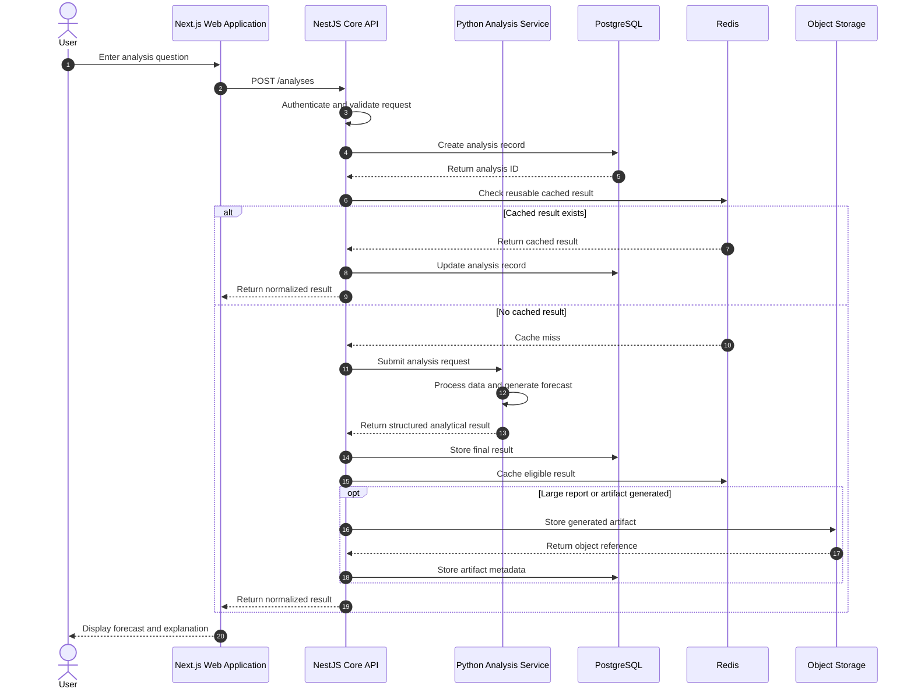
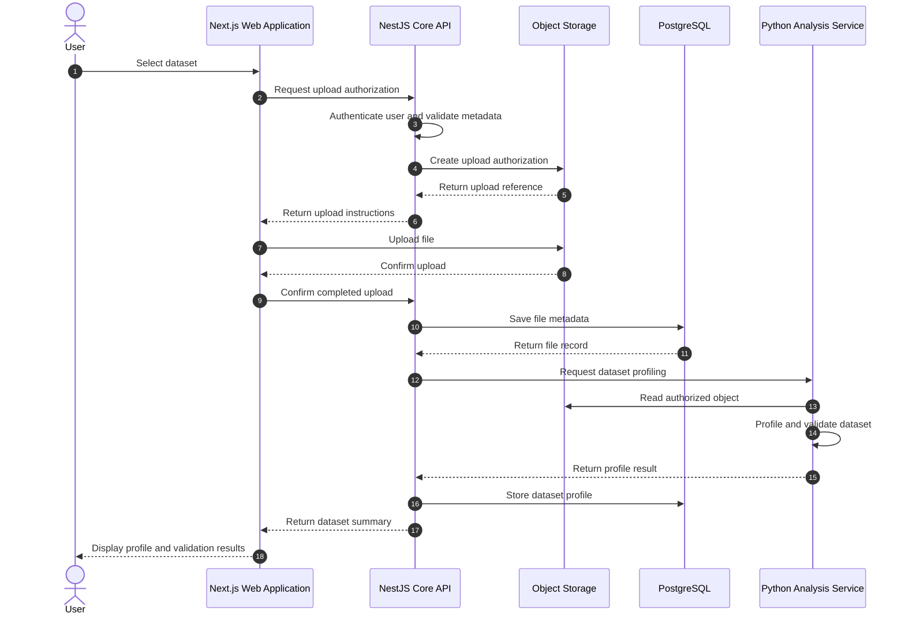
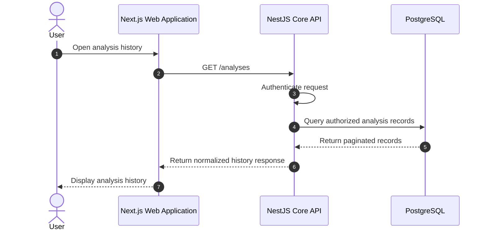

# ForecastMe Data Flow

## 1. Purpose

This document describes how data moves between ForecastMe components.

The initial system includes:

* Next.js Web Application
* NestJS Core API
* Python Analysis Service
* PostgreSQL
* Redis
* Object Storage

The NestJS Core API is the main gateway between the browser and the platform's internal services.

---

## 2. Primary Analysis Flow



---

## 3. Text-Based Analysis Request

A text-based analysis begins when a user submits a question.

Example:

```text
What is the estimated probability that Team A defeats Team B?
```

### Step 1: User input

The Web Application captures:

* User question
* Selected analysis domain
* Optional time horizon
* Optional risk preference
* Optional user constraints
* Optional attached data-source references

### Step 2: API request

The Web Application sends a request to the Core API.

Example conceptual request:

```json
{
  "question": "What is the estimated probability that Team A defeats Team B?",
  "domain": "sports",
  "timeHorizon": "next_match",
  "options": {
    "includeExplanation": true
  }
}
```

### Step 3: Authentication and validation

The Core API:

* Identifies the user
* Validates the request schema
* Applies authorization rules
* Applies rate limits
* Sanitizes accepted input
* Generates a correlation ID
* Creates an analysis record

### Step 4: Cache lookup

The Core API may check Redis for an equivalent recent analysis.

A cached result should only be used when:

* The input is equivalent
* The data sources have not become stale
* The model version is compatible
* The cache has not expired
* The user is authorized to access the result

### Step 5: Analysis-service request

When fresh analysis is required, the Core API calls the Analysis Service.

The internal request may include:

```json
{
  "analysisId": "analysis_identifier",
  "question": "What is the estimated probability that Team A defeats Team B?",
  "domain": "sports",
  "parameters": {
    "timeHorizon": "next_match"
  },
  "context": {
    "correlationId": "request_identifier"
  }
}
```

The internal request should avoid containing unnecessary private user information.

### Step 6: Analytical processing

The Analysis Service may perform:

* Input classification
* Data validation
* Data-source selection
* Data retrieval
* Data cleaning
* Feature construction
* Model selection
* Model inference
* Probability calibration
* Confidence estimation
* Explanation generation

### Step 7: Structured result

The Analysis Service should return machine-readable data.

Example conceptual response:

```json
{
  "analysisId": "analysis_identifier",
  "status": "completed",
  "result": {
    "outcome": "Team A win",
    "probability": 0.58,
    "confidence": 0.71
  },
  "assumptions": [
    "Current squad availability remains unchanged"
  ],
  "limitations": [
    "Late injuries may materially change the estimate"
  ],
  "model": {
    "name": "sports_match_baseline",
    "version": "0.1.0"
  }
}
```

The Analysis Service should not return unstructured prose as the only result.

Narrative explanations may be included, but core values must use explicit fields.

### Step 8: Persistence

The Core API stores the result in PostgreSQL.

Stored information should eventually include:

* Analysis ID
* User ID
* Original question
* Domain
* Status
* Input parameters
* Output probability
* Confidence value
* Assumptions
* Limitations
* Model name
* Model version
* Creation time
* Completion time
* Correlation ID

### Step 9: Response to frontend

The Core API returns a stable public response.

The frontend should not depend directly on the Analysis Service's internal response format.

This permits the internal Python contract to evolve without breaking the Web Application.

---

## 4. File Upload Flow

Users may upload datasets for analysis.

Supported formats may eventually include:

* CSV
* Excel
* JSON



### File upload responsibilities

The Web Application handles:

* File selection
* Client-side size checks
* Upload progress
* User feedback
* Upload cancellation

The Core API handles:

* Authentication
* File-policy enforcement
* Upload authorization
* Ownership records
* Metadata persistence
* Analysis orchestration

Object storage handles:

* File bytes
* Durable object storage
* Object retrieval
* Lifecycle policies

The Analysis Service handles:

* File parsing
* Schema detection
* Dataset profiling
* Missing-value analysis
* Numeric summaries
* Type inference
* Analytical preprocessing

PostgreSQL stores:

* File owner
* Original filename
* Storage object key
* MIME type
* File size
* Checksum
* Upload status
* Dataset profile
* Creation timestamp

---

## 5. Analysis History Flow



The Core API must ensure users can only retrieve analyses they are authorized to access.

---

## 6. Redis Data Flow

Redis is used only for temporary or derived state.

Potential Redis data includes:

* Cached analysis results
* Rate-limit counters
* Idempotency keys
* Temporary analysis progress
* Distributed locks
* Short-lived provider responses

Example conceptual key structure:

```text
forecastme:analysis-cache:{hash}
forecastme:rate-limit:{userId}
forecastme:idempotency:{key}
forecastme:analysis-status:{analysisId}
```

Redis keys must have appropriate expiration periods.

Permanent analysis records must be stored in PostgreSQL.

---

## 7. Object Storage Data Flow

Large objects should not be stored directly in PostgreSQL.

Examples:

```text
datasets/{userId}/{fileId}/source.csv
reports/{userId}/{analysisId}/report.pdf
models/{modelName}/{version}/model.bin
exports/{userId}/{analysisId}/result.json
```

PostgreSQL stores the metadata and object key.

Access to objects should be authorized through the Core API or short-lived signed URLs.

Object storage buckets must not be publicly readable by default.

---

## 8. Error Flow

Errors should be translated at service boundaries.

### Analysis Service error

The Analysis Service may return an internal error such as:

```json
{
  "code": "DATASET_SCHEMA_INVALID",
  "message": "The dataset does not contain the required target column."
}
```

The Core API should map this to a stable public error:

```json
{
  "statusCode": 422,
  "code": "INVALID_ANALYSIS_INPUT",
  "message": "The uploaded dataset cannot be analyzed with the selected configuration.",
  "correlationId": "request_identifier"
}
```

The frontend should display a useful message without exposing:

* Stack traces
* Internal hostnames
* Database details
* Provider credentials
* Internal file paths

---

## 9. Data Classification

ForecastMe data should eventually be classified as:

### Public data

Examples:

* Public sports results
* Public stock-market data
* Public weather data
* Published economic indicators

### User-owned data

Examples:

* Uploaded datasets
* Saved forecasts
* Analysis history
* User preferences
* Portfolio configurations

### Sensitive operational data

Examples:

* API keys
* Database credentials
* Storage credentials
* Authentication secrets
* Internal service tokens

Sensitive operational data must remain server-side.

---

## 10. Correlation and Observability

Every external request should receive a correlation ID.

Example:

```text
X-Correlation-ID: 8a23d94e-2f87-4a07-a33f-96a89ca17251
```

The same identifier should appear in logs generated by:

* Core API
* Analysis Service
* Database-operation logging
* Object-storage workflow logging

This makes it possible to trace one user operation across multiple services.

---

## 11. Initial Data-Flow Rules

The following rules apply to the initial architecture:

1. The browser communicates with the Core API.
2. The browser does not communicate directly with PostgreSQL.
3. The browser does not communicate directly with Redis.
4. The browser does not possess permanent object-storage credentials.
5. The browser does not directly call the Analysis Service in production.
6. The Core API controls authentication and authorization.
7. The Analysis Service owns analytical computation.
8. PostgreSQL stores durable relational records.
9. Redis stores temporary or cached state.
10. Object storage stores large files and artifacts.
11. Service responses must use structured contracts.
12. Internal errors must be normalized before reaching the frontend.
13. Predictions must include assumptions and limitations where applicable.
